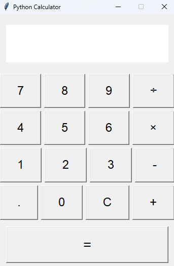

# ماشین حساب با Python و Tkinter

یک ماشین حساب گرافیکی ساده و کاربردی با **Python** و **Tkinter**، مناسب برای یادگیری مفاهیم مقدماتی ساخت رابط کاربری در پایتون.

## تصویر پروژه



## امکانات

* جمع
* تفریق
* ضرب
* تقسیم
* اعداد اعشاری
* مدیریت خطا
* رابط گرافیکی ساده و کاربردی

## پیش‌نیازها

* Python 3
* Tkinter

## دریافت پروژه

```bash
git clone https://github.com/taha-heidaryfard/python-tkinter-calculator.git
```

وارد پوشه پروژه شوید:

```bash
cd python-tkinter-calculator
```

## اجرا

```bash
python calculator.py
```

## ساختار پروژه

```text
python-tkinter-calculator/
│
├── calculator.py
├── README.md
├── .gitignore
└── images/
    └── calculator.png
```

## مقاله آموزشی

آموزش کامل ساخت این ماشین حساب را می‌توانید در وب‌سایت من مطالعه کنید:

[taha-heidaryfard.ir](https://taha-heidaryfard.ir?utm_source=chatgpt.com)

## لایسنس

این پروژه تحت مجوز MIT منتشر شده است.
